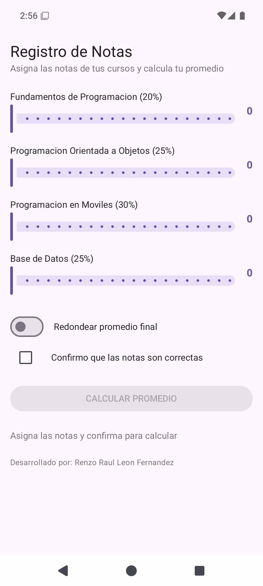
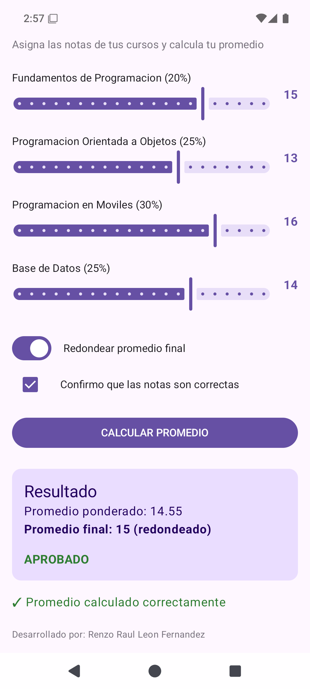

# Lab03 - Registro de Notas (tarea)

**Alumno:** Renzo Raúl León Fernández
**Curso:** Programación en Móviles - 4to Ciclo
**Docente:** Juan José León Suiyon

## Descripción

App hecha con Jetpack Compose que calcula el promedio ponderado de cuatro cursos.
Cada curso tiene su propio `Slider` de 0 a 20 con valores enteros y muestra la
nota elegida al costado. Un `Switch` decide si el promedio final se redondea y un
`Checkbox` habilita el botón CALCULAR PROMEDIO: mientras no esté marcado, el botón
se queda gris y no responde.

Al calcular aparece una `Card` con el promedio ponderado a 2 decimales, el promedio
final y la observación, cuyo color cambia según el rango obtenido.

## Pesos de los cursos

| Curso | Peso |
| --- | --- |
| Fundamentos de Programación | 20% |
| Programación Orientada a Objetos | 25% |
| Programación en Móviles | 30% |
| Base de Datos | 25% |

## Observación según el promedio final

| Promedio final | Observación | Color |
| --- | --- | --- |
| 17 a 20 | EXCELENTE | Verde oscuro |
| 13 a 16.99 | APROBADO | Verde |
| 10 a 12.99 | EN RECUPERACIÓN | Ámbar |
| Menor a 10 | DESAPROBADO | Rojo |

## Cómo funciona por dentro

Cada nota es un estado propio declarado con `remember` y `mutableStateOf`, igual
que los campos de texto del laboratorio guiado. La diferencia es el tipo: el
`Slider` trabaja con `Float`, así que la nota se guarda como `Float` y se muestra
con `toInt()`. El `Switch` y el `Checkbox` usan el mismo dúo de estado, pero con
`Boolean`.

El promedio ponderado multiplica cada nota por su peso. El promedio final usa
`roundToInt()` solo cuando el `Switch` está activo. La observación y su color se
eligen con un `when` sobre el promedio final.

## Casos de prueba verificados

| Notas (F, POO, M, BD) | Redondear | Ponderado | Final | Observación |
| --- | --- | --- | --- | --- |
| 15, 13, 16, 14 | ON | 14.55 | 15 | APROBADO |
| 12, 10, 11, 9 | OFF | 10.45 | 10.45 | EN RECUPERACIÓN |
| 18, 17, 19, 18 | ON | 18.05 | 18 | EXCELENTE |
| 8, 9, 7, 10 | OFF | 8.45 | 8.45 | DESAPROBADO |

## Capturas

Pantalla inicial (notas en 0, botón deshabilitado):

Después de asignar las notas, confirmar y presionar CALCULAR PROMEDIO:

