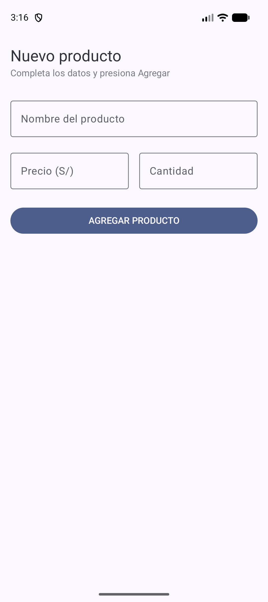
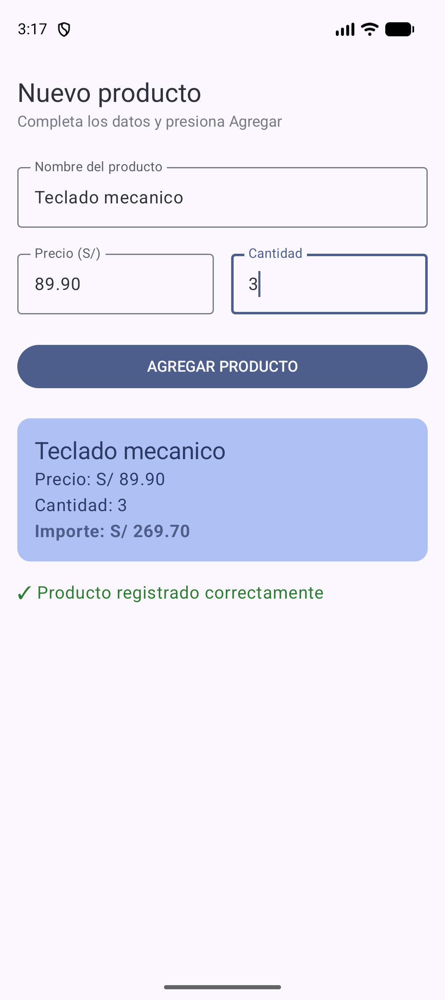
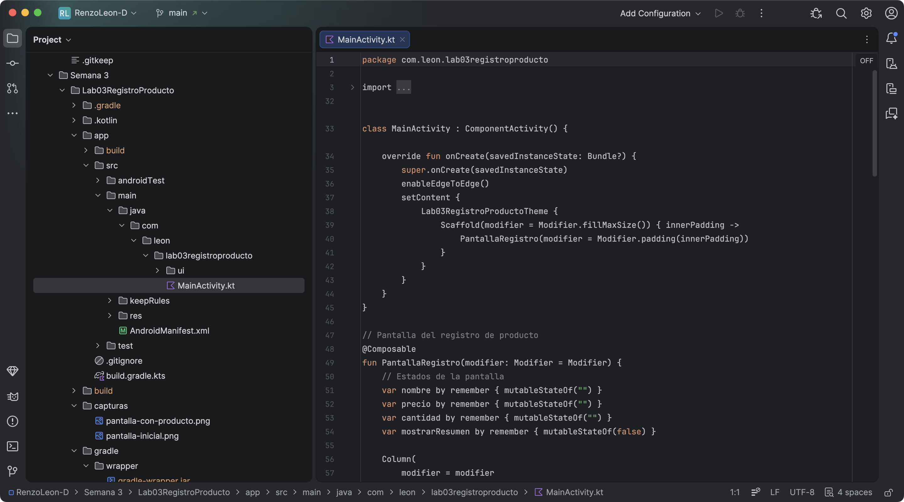
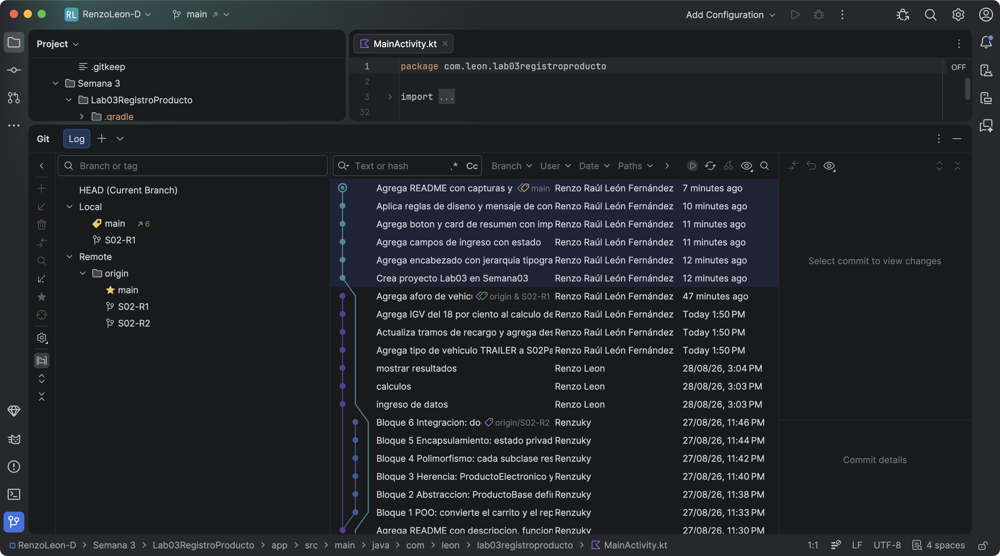

# Lab03 - Registro de Producto

**Alumno:** Renzo Raúl León Fernández
**Curso:** Programación en Móviles - 4to Ciclo
**Docente:** Juan José León Suiyon

## Descripción

App hecha con Jetpack Compose que registra un producto. La pantalla tiene tres
campos de ingreso (nombre, precio y cantidad), un botón AGREGAR PRODUCTO y una
Card que muestra el resumen con el importe calculado (precio × cantidad) con 2
decimales.

El estado de la pantalla se maneja con `remember` y `mutableStateOf`. El precio y
la cantidad se leen con `toDoubleOrNull` y `toIntOrNull` junto al operador Elvis
`?:`, para que la app no se caiga si el usuario escribe letras.

## Capturas

Pantalla inicial (formulario vacío):

Después de presionar AGREGAR PRODUCTO:

## Evidencias del desarrollo

Estructura del proyecto y código en Android Studio (rama `main`, proyecto dentro
de `Semana 3`):

Historial de los 6 commits de la sesión:

## ¿Qué pasaría si declaras las variables de los campos SIN remember?

Sin `remember` la variable se vuelve a crear en cada recomposición, así que
regresa a su valor inicial (`""`). Al escribir en el campo, Compose se redibuja y
el texto se pierde: el `OutlinedTextField` se queda vacío y parece que no se
puede escribir nada. Con `remember` el valor se conserva entre recomposiciones y
por eso sí se ve lo que uno escribe.
