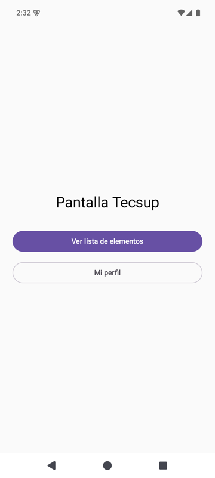
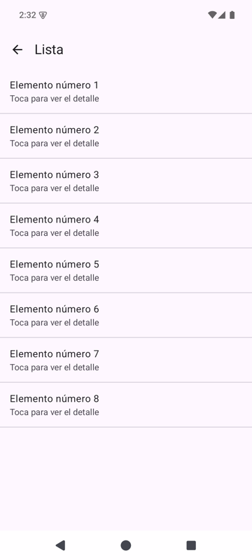
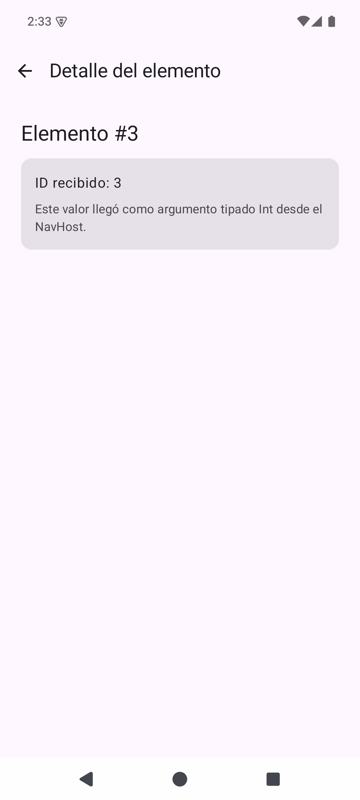
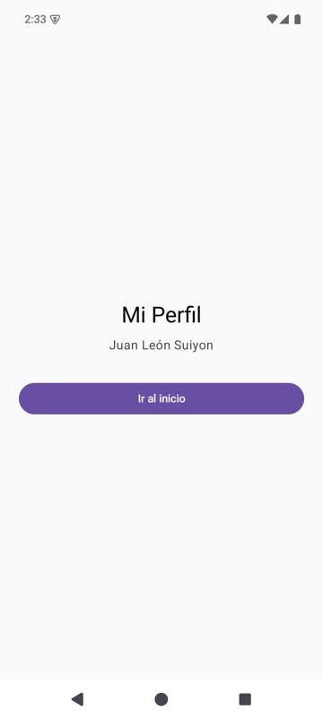
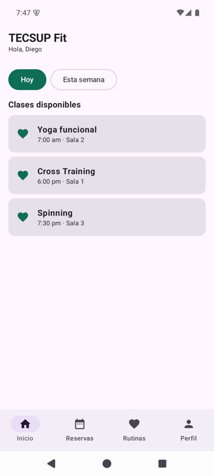
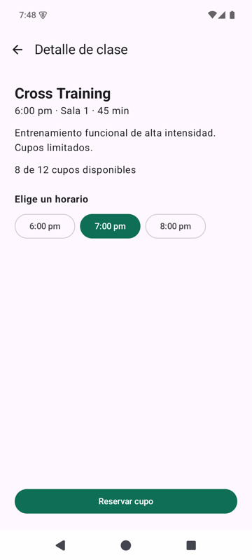
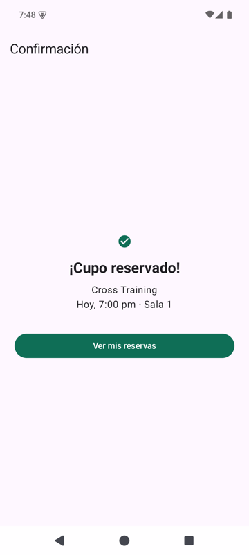
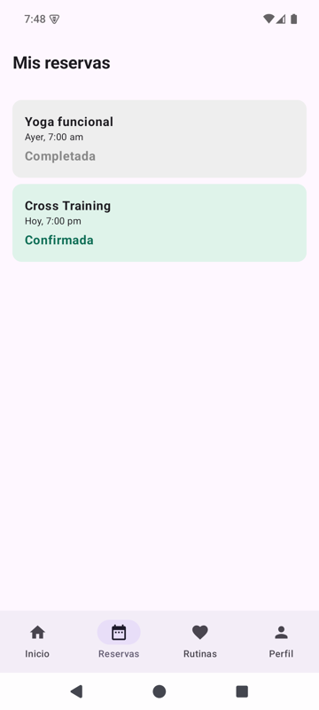
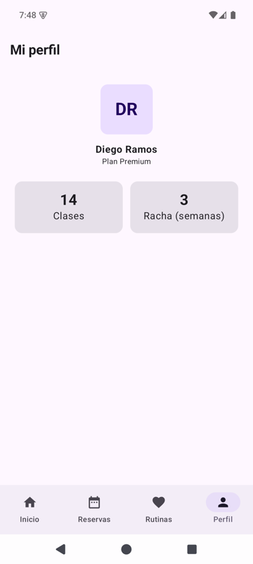

# Semana 5 - Navegación en Jetpack Compose

**Alumno:** Renzo Raúl León Fernández
**Curso:** Programación en Móviles - 4to Ciclo
**Docente:** Juan José León Suiyon

Esta semana tiene dos trabajos. El primero es la guía de laboratorio, que arma una app
de cuatro pantallas para aprender a navegar entre vistas. El segundo es la tarea
integradora de las semanas 1 a 6, que se entrega en dos versiones: TECSUP Fit y
Clínica Salud+. Ninguna de las dos usa ViewModel: todo el estado se guarda con
`remember`.

| Carpeta | Trabajo | Estado |
| --- | --- | --- |
| `Semana05_Navegacion` | Trabajo 1: guía de navegación | Terminado (rama main) |
| `TecsupFit` | Trabajo 2, opción B: TECSUP Fit | Terminado (rama main) |
| `ClinicaSalud` | Trabajo 2, opción A: Clínica Salud+ | En progreso |

Cada carpeta es un proyecto independiente de Android Studio. Para abrirlo: **File >
Open** y elegir la carpeta del proyecto (no la carpeta `Semana 5`).

## Trabajo 1 - Guía: Navegación en Jetpack Compose

App de la guía de laboratorio con cuatro pantallas: Inicio, Lista, Detalle y Perfil.
Desde Inicio se va a la Lista o al Perfil; al tocar un elemento de la Lista se abre su
Detalle, que recibe el número del elemento elegido.

| Paso de la guía | Qué se hace | Estado |
| --- | --- | --- |
| 1 y 2 | Crear el proyecto y agregar la dependencia `navigation-compose` | Hecho |
| 3 y 4 | Paquetes `navigation` y `screens`, y rutas en `Screen.kt` con una sealed class | Hecho |
| 5 | `AppNavigation` con el `NavHost` y `MainActivity` que lo muestra | Hecho |
| 6 | `HomeScreen` y `ListScreen` con `LazyColumn` | Hecho |
| 7 | `DetailScreen` con el argumento `itemId` y `ProfileScreen` con `popUpTo` | Hecho |
| 8 | Ejecutar y verificar el flujo completo | Hecho |

### Cómo funciona

Las rutas están juntas en `Screen.kt`, una sealed class donde cada pantalla es un
`object` con su nombre de ruta. `AppNavigation` crea el `navController` y el
`NavHost`, que registra cada pantalla con `composable`. La ruta del detalle lleva el
hueco `{itemId}`: la Lista navega con `createRoute(index + 1)` y el `NavHost` lee ese
valor como `Int` (por `NavType.IntType`) antes de pasárselo a `DetailScreen`.

La flecha de volver usa `popBackStack()`, que quita la pantalla de arriba. El botón
"Ir al inicio" del Perfil usa `popUpTo` con `inclusive = true` para no ir apilando
Inicios repetidos cada vez que se vuelve.

Además de la dependencia de la guía se agregó `material-icons-core`, porque las
plantillas nuevas de Android Studio ya no traen los íconos (la flecha de volver)
dentro de Material 3.

### Capturas

| Inicio | Lista | Detalle | Perfil |
| --- | --- | --- | --- |
|  |  |  |  |

## Trabajo 2 - Opción B: TECSUP Fit

Reserva de clases de gimnasio. El flujo principal es Inicio, Detalle de clase y
Confirmación, y la navegación secundaria es una barra inferior con cuatro pestañas.

### Requerimientos funcionales

| Código | Requerimiento | Estado |
| --- | --- | --- |
| RF-B01 | Inicio con una `LazyRow` de chips ("Hoy" y "Esta semana") que filtran la `LazyColumn` de clases, cada una con nombre y horario | Hecho |
| RF-B02 | Barra inferior con 4 pestañas (Inicio, Reservas, Rutinas y Perfil), visible en esas pantallas y con la pestaña actual resaltada | Hecho |
| RF-B03 | Detalle de clase que recibe el id de la clase por la ruta y muestra sus datos | Hecho |
| RF-B04 | Selección única de horario: solo se puede elegir uno y "Reservar cupo" se habilita cuando hay uno elegido | Hecho |
| RF-B05 | Confirmación con la clase y el horario; "Ver mis reservas" lleva a Reservas sin volver a pasar por el Detalle | Hecho |
| RF-B06 | Mis reservas: lista con el estado de cada reserva (Confirmada en verde, Completada en gris); la reserva nueva aparece al instante | Hecho |
| RF-B07 | Perfil con los datos del usuario y estadísticas simples (clases tomadas y racha) | Hecho |

### Rutas

| Ruta | Pantalla |
| --- | --- |
| `home` | Inicio |
| `reservas` | Mis reservas |
| `rutinas` | Rutinas |
| `perfil` | Mi perfil |
| `detalle/{claseId}` | Detalle de clase |
| `confirmacion/{claseId}/{horarioIndex}` | Confirmación |

### Respuestas para la sustentación

**¿Cómo llega la clase elegida hasta la Confirmación?** Al tocar una tarjeta en Inicio se
navega a `detalle/{claseId}` con el id de esa clase. El `NavHost` lee ese número y se
lo pasa a `DetalleScreen`, que busca la clase en la lista. Al reservar se navega a
`confirmacion/{claseId}/{horarioIndex}` con el mismo id y la posición del horario
elegido, y la Confirmación vuelve a buscar la clase y el horario con esos dos números.

**¿Cómo sabe la barra inferior qué ícono resaltar?** Cada pantalla llama a
`BarraInferior` pasándole su propia ruta. Dentro, cada pestaña compara esa ruta con la
suya y solo la que coincide queda marcada como seleccionada.

**¿Por qué los chips de horario se comportan como un RadioButton?** Porque los tres
dependen de un solo estado, `horarioElegido`, que guarda la posición del horario. Al
tocar un chip ese estado cambia y se vuelven a dibujar todos: solo el que coincide sale
relleno, así que nunca puede haber dos elegidos a la vez.

### Capturas

| Inicio | Detalle | Confirmación | Reservas | Perfil |
| --- | --- | --- | --- | --- |
|  |  |  |  |  |

## Trabajo 2 - Opción A: Clínica Salud+

Reserva de citas médicas. El flujo principal es Inicio, Perfil del médico, Agendar cita
y Confirmación, y la navegación secundaria es un menú lateral que se abre con el ícono ☰.

### Requerimientos funcionales

| Código | Requerimiento | Estado |
| --- | --- | --- |
| RF-A01 | Inicio con una `LazyRow` de chips de especialidad que filtran la `LazyColumn` de médicos, cada uno con nombre, especialidad y calificación | Hecho |
| RF-A02 | Menú lateral con el ícono ☰ en la barra superior y los destinos Inicio, Mis citas, Historial médico y Perfil; la sección actual se resalta | Hecho |
| RF-A03 | Historial médico y Perfil del paciente, a los que se entra desde el menú | Hecho |
| RF-A04 | Perfil del médico que recibe el id del médico por la ruta, con el botón "Agendar cita" | Pendiente |
| RF-A05 | Agendar cita: elegir una fecha y una hora (selección única, 3 opciones cada una); "Confirmar cita" se habilita solo con ambas elegidas | Pendiente |
| RF-A06 | Confirmación con médico, fecha y hora; "Volver al inicio" limpia el historial | Pendiente |
| RF-A07 | Mis citas: lista con el estado de cada cita (Confirmada y Completada con colores distintos); la cita nueva aparece al instante | Pendiente |

## Avance

### Rama main

- [x] Guía: Crea proyecto Semana05_Navegacion en Semana 5 con navigation-compose
- [x] Guía: Agrega Screen con las rutas de la guia en una sealed class
- [x] Guía: Agrega AppNavigation con NavHost, HomeScreen y conecta MainActivity
- [x] Guía: Agrega ListScreen con LazyColumn y registra la ruta list
- [x] Guía: Agrega DetailScreen con argumento itemId y ProfileScreen con popUpTo
- [x] Guía: Agrega capturas del flujo de la guia al README
- [x] TECSUP Fit: Crea proyecto TecsupFit en Semana 5 con navigation-compose y color verde
- [x] TECSUP Fit: Agrega rutas en sealed class y datos de clases en TecsupFit
- [x] TECSUP Fit: Agrega NavHost y pantalla Inicio con Scaffold en TecsupFit
- [x] TECSUP Fit: Agrega LazyRow de filtros y LazyColumn de clases en Inicio de TecsupFit
- [x] TECSUP Fit: Agrega bottomBar con 4 pestanas y pantallas Reservas, Rutinas y Perfil
- [x] TECSUP Fit: Agrega Detalle de clase con parametro claseId y seleccion unica de horario
- [x] TECSUP Fit: Agrega Confirmacion de reserva con clase y horario y vuelta con popUpTo
- [x] TECSUP Fit: Guarda las reservas con mutableStateListOf y muestra su estado en Reservas
- [x] TECSUP Fit: Agrega estadisticas al Perfil de TecsupFit y capturas al README
- [x] Clínica Salud+: Crea proyecto ClinicaSalud en Semana 5 con navigation-compose y color morado
- [x] Clínica Salud+: Agrega rutas en sealed class y datos de medicos en ClinicaSalud
- [x] Clínica Salud+: Agrega NavHost y pantalla Inicio con Scaffold en ClinicaSalud
- [x] Clínica Salud+: Agrega LazyRow de especialidades y LazyColumn de medicos en Inicio
- [x] Clínica Salud+: Agrega menu lateral con DrawerState y secciones Mis citas, Historial y Perfil
- [ ] Clínica Salud+: Agrega Perfil del medico con parametro medicoId
- [ ] Clínica Salud+: Agrega Agendar cita con seleccion unica de fecha y hora
- [ ] Clínica Salud+: Agrega Confirmacion de cita con medico, fecha y hora y vuelta con popUpTo
- [ ] Clínica Salud+: Guarda las citas con mutableStateListOf, muestra su estado y agrega capturas al README

### Rama mejora-ia

- [ ] Guía: mejora de la presentación con componentes independientes y el prompt en este README
- [ ] TECSUP Fit: mejora funcional con IA y `PROMPTS.md`
- [ ] Clínica Salud+: mejora funcional con IA y `PROMPTS.md`
